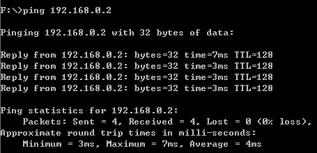

# EMAC Library for TAIJIUINO Due Pro R2

This library is used to test the EMAC function of 

##Note##

This library is develop by [Palliser](http://forum.arduino.cc/index.php?PHPSESSID=bbd7atuo3331b4hiqei9ivf4r3&action=profile;u=148087) from Arduino forum, and it is not the final version. [Forum Discussion](http://forum.arduino.cc/index.php?PHPSESSID=9jo0108im6j0sc2bm0mndvbgq7&topic=142908.0).

*[Palliser's github](https://github.com/Palliser), Palliser think the code is not perfect enough, so he didn't upload these codes at present.*

*We upload it here just want to make a demo to our users.*

## How To ##

Place 
emac.h rstc.h ---->   ...\arduino-1.5.2-windows\arduino-1.5.2\hardware\arduino\sam\system\libsam\include   
emac.c rstc.c ---->   ...\arduino-1.5.2-windows\arduino-1.5.2\hardware\arduino\sam\system\libsam\source respectively

variant.cpp and variant.h ---> ...\arduino-1.5.2-windows\arduino-1.5.2\hardware\arduino\sam\variants\arduino_due_x, **arduino_due_x** folder alread have variant.cpp and variant.h, you need replace them, back up first. 

*emac.h, rstc.h, emac.c, rstc.c, variant.cpp and variant.h are in CopyToAnotherDir*

Copy **EMAC** folder to **$ArduionScketch/libraries**

Connect **DUE Ethernet Module** with **TAIJIUINO Due Pro R2**, open example **Arduino\_Due\_EMAC\_Mod**, upload it to **TAIJIUINO Due Pro R2**, set your PC ip address to **192.168.0.3**, submask **255.255.255.0**, gate way **192.168.0.1**. 

Ping 192.168.0.2, and the result:

